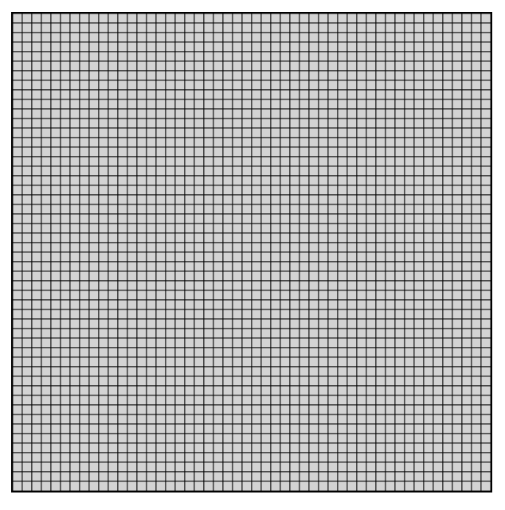
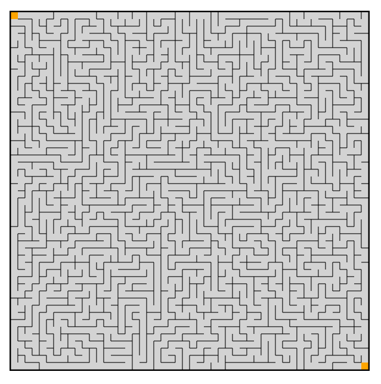

# Maze Generator
_Generate complex mazes at the push of a button_

You have the option to generate large mazes by changing the dimensions of the maze grid. Another option you have is to view the Depth First Search algorithm generate the maze. Once you've specified those details simply press 'solve'. 
Once your maze has been generated you can simply save it as an image or print it.

## Development Process
With the use of JavaScript directly connected to HTML <canvas> element. The grid (of object Grid in /javascript/models.js) is a 2D array containing Cell objects (in /javascript/models.js) which are used to manipulate how the maze is generated and managed. All display events are handled in the /javascript/views.js module which allows us to display the grid according to each of the Cell's characteristics.

Example of created 50x50 grid:

With every stored Cell in the 2D array, we are able to use randomized Depth First Search (DFS) to create a maze by starting at a random cell, tracking the cells which have been visited, and visiting random unvisited neighboring cells until no unvisiting cells remain.

You are able to view the Depth First Search algorithm at work in the site.

Example of DFS working in a 50x50 grid.

Resulting generated maze:

The solution algorithm works similar to DFS by having as stack of all visited cells, removing from the stack those cells which have been visited and end in a wall, and returning only those which have reached the final destination successfully. 

---

Overall, fun project.
